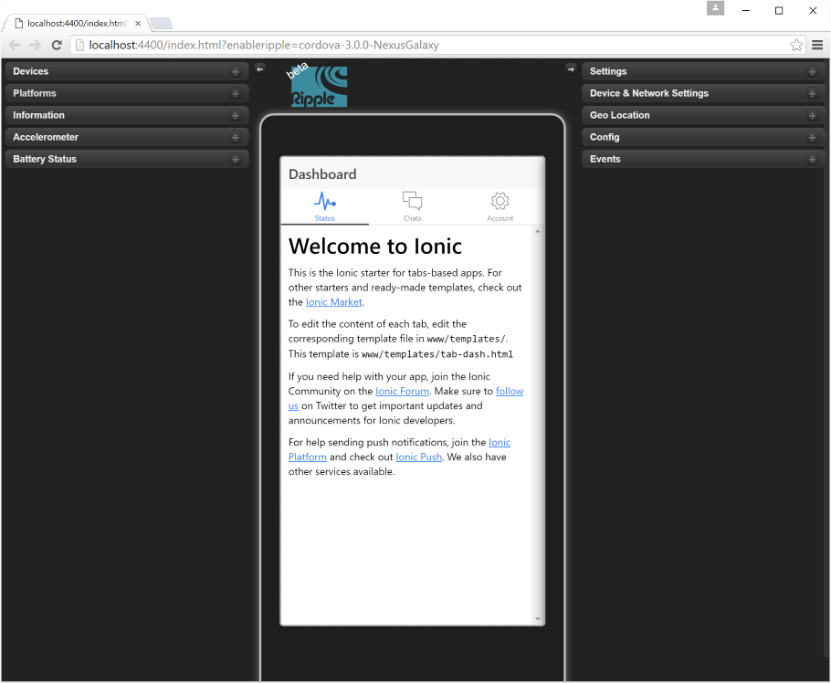
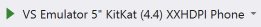
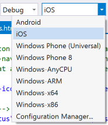
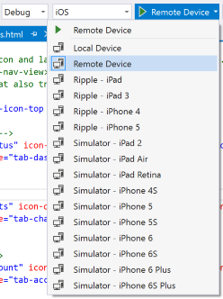
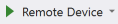
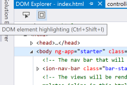
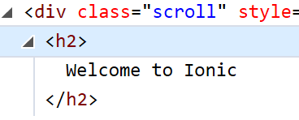
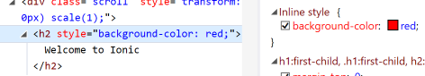

# Visual Studio TACO in 15 minutes
#Overview
Apache Cordova is an open-source framework that allows you to write apps for Android, iOS, Windows, and other mobile platforms, using nothing but HTML, CSS, and JavaScript. The apps built by Cordova are called hybrid apps - they aren't native apps and they aren't simple web apps, but a combination of both. Hybrid apps can have access to native device APIs and their layout rendering is done via Web views instead of the platform's native UI framework. 

To help you build apps using Cordova, Microsoft Visual Studio 2015 includes the Visual Studio Tools for Apache Cordova (also known as TACO). 

This tutorial takes you through the basics of Apache Cordova and Visual Studio TACO, by building a simple Getting Started app.

Want to see someone go through this demo? Check it out here (location TBD). 

## What will you learn in this session?
* Learn how to create a new Apache Cordova project in Visual Studio.
* (Really?) Understand the basics of the Ionic framework, a popular JavaScript framework for Cordova developers.
* See how you can use Visual Studio to debug and test your app on Android, iOS, and Windows emulators and devices.

## Who is this session for?
This session is for any developer already familiar with Visual Studio. Prior experience with web development isn't needed, but the experience and languages will make more sense to you if you are a web developer. 

## What do you need to get started?
* Windows 10
* Install [Visual Studio 2015](http://www.visualstudio.com) Update 2
    * Include Apache Cordova features by following the [VS TACO Installation Guide](http://taco.visualstudio.com/en-us/docs/install-vs-tools-apache-cordova/)
    * Include the Visual Studio Emulator for Android feature
* [Ionic Project Templates for Visual Studio](https://visualstudiogallery.msdn.microsoft.com/4e44ba8b-a4c8-4106-b70e-00d63241a54a)
* (Optional) Setup iOS builds by following the [iOS Setup Guide](http://taco.visualstudio.com/en-us/docs/ios-guide/).

> **Note**: If you're going to use an existing Visual Studio 2015 installation, be sure you have the latest Updates to Visual Studio and TACO.

## Build a sample application
### Step 1: Create a new project in Visual Studio
First, launch Visual Studio 2015. Then, create a new project using the **File | New | Project...** menu.

Browse to  **Installed | Templates | JavaScript | Apache Cordova Apps** in the new project dialog and choose the **Ionic Tabs Template** as your project template.

Give your project a name and then click **OK**.

> **Note**: This template uses the Ionic Framework, which is a popular JavaScript/CSS framework built for Cordova development. You can learn more about it at [http://www.ionicframework.com](http://www.ionicframework.com).

You'll now see the default project structure in your solution explorer, it should look like the following.

A few things worth calling out here:
* The `www` folder is where your main app source code lives. In this template, `www/index.html` is the first screen of your app.
* `config.xml` is the Cordova configuration file.
* The `plugins` folder is a home for plugins. In Cordova, you use plugins to access native device capabilities, like the camera.

### Step 2: Run the project in the browser
Let's run the app in the browser and see what it looks like. In the Debug Toolbar, choose the **Ripple - Nexus Galaxy** option to start debugging.

After the app is built, you will see the Google Chrome browser launch with your app loaded into the Ripple simulator. Ripple is an add-on to Google Chrome, useful for early debugging of an mobile web application. It provides features like device skinning, and simulation of features like device rotation. 

> **Note**: For this template, when you run the app in Ripple, you'll see error messages similar to the following. You can choose the **Success!** button and the app will continue to work for testing. These dialogs appear because this template is using Cordova plugins that will only work on an emulator or device, but will not work in Ripple.

> **Note**: The Ripple simulator is available to use in Visual Studio for both iOS and Android development. Windows apps will be simulated natively in Windows.

Back in Visual Studio, you'll see the DOM Explorer and JavaScript Console windows opened. These tools to help you debug your applications.

When using Ripple, Visual Studio provides a live reload experience which rapidly pushes changes to the browser as you modify your source code. To see this in action, let's open the `www/templates/tabs.html` file and change code on line 14:

`<ion-tab title="Chats" icon-off="ion-ios-chatboxes-outline" icon-on="ion-ios-chatboxes" href="#/tab/chats">`

so that the Chats tab is named "Messages":

`<ion-tab title="Messages" icon-off="ion-ios-chatboxes-outline" icon-on="ion-ios-chatboxes" href="#/tab/chats">`

When you save the file you'll see that the Chrome browser is refreshed and your label change is made.

### Step 3: Run and debug on an Android Emulator

Now, back in Visual Studio, let's use the Visual Studio Emulator for Android. From the Debug Target drop down, choose the "VS Emulator 5" KitKat (4.4) XXHDPI Phone" target:

And click on the  button to run the app:

The project will build and in a moment you'll see your application launch in the Visual Studio Emulator for Android.

The emulator helps you test an application using a more realistic environment than in the Ripple emulator, with a trade-off of some slow-down in deploying your app. Along with running an actual device operating system, it also provides a set of tools to simulate actions like shaking the device and taking pictures. Take a moment to explore the tools provided by the emulator in the toolbox to the right of the device screen.

 

The same Visual Studio DOM Explorer, JavaScript Console, and debugging tools you used with Ripple are also working against the emulator. Let's try the JavaScript debugger this time. To do that, open up the file `www/js/controllers.js`. On line 16 (the line that says `Chats.remove(chat);`), set a breakpoint by clicking in the margin to the left of the line.

Now, in the running app go to the Messages tab. Use your cursor (or finger, on a touch screen device) to swipe the first message to the left. A **Delete** button will appear, tap on it.

You'll see the breakpoint hit back in Visual Studio. You can explore the call stack, locals, and watch windows the same as if you were running the app in a browser. Hover over the `chat` parameter to see the values being passed to the `remove` fuction.

 

### Demo 2 - Run on a live device
Along with Ripple, and emulators, you can deploy to iOS, Android, or Windows devices that you have connected to your PC. Let's run on an iOS device.

> **Note** Before going through this step, be sure to follow the pre-requisites to setup iOS builds using the [iOS Setup Guide](http://taco.visualstudio.com/en-us/docs/ios-guide/).

We'll use the Remote Device workflow for this session, which enables you to connect an iOS device to a Mac and use Visual Studio to remotely debug your app running on that device.

Connect an iOS device to the Mac you have setup with the `remotebuild` agent. Then, in Visual Studio, change the target device platform to **iOS**:

and select the **Remote Device** target.

Then click on the  button to run the app. 

After the build is completed, your app will be deployed to the device. In Visual Studio, you'll see again that the DOM Explorer and debugging tools appear.

Let's try the DOM explorer this time. In Visual Studio, change to the DOM Explorer window and choose the **Select Element** option. Now, on the physical device, tap an element on the screen, using your finger. You'll see that the item you selected on the device is now selected in the DOM Explorer.

Changes made in the DOM explorer will appear live on your device. Using the **Select Element** button from above, click on the "Welcome" header in the home page of the app. Then, in the DOM explorer highlight the `h2` element that contains the Welcome text.

Now, in the **Styles** pain on the right-side of the screen, click in the inline style section to add the following code:

`
background-color: red;
`  

When done, your DOM explorer window should look like the following and you'll see a red header in your app:

 

Congratulations! You've just made it to the end of this session!

In these 15 minutes you:
* Created a simple mobile app using Apache Cordova and the Ionic framework.
* Tested the app in the Ripple mobile simulator, on an Android emulator, and deployed the app to iOS.
* Used Visual Studio to edit source files in the app and see them reload live in the browser.
* Debugged JavaScript running in the app.
* Modified the HTML DOM, live, using the DOM Explorer.

For a next step, go to [taco.visualstudio.com](http://taco.visualstudio.com) to learn more about developing apps with Visual Studio and TACO.
